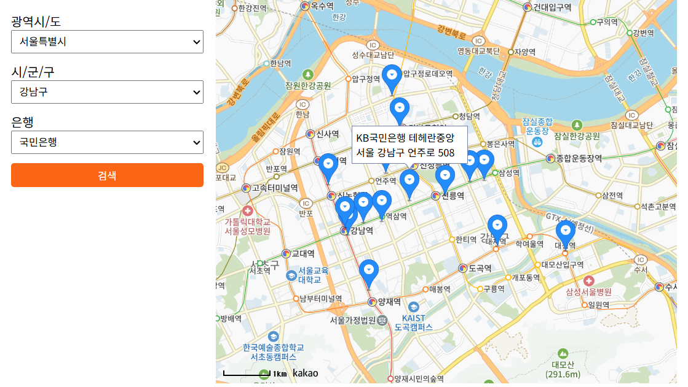

# pjt-07

# 은행 찾기 기능 웹 애플리케이션

## 프로젝트 소개

이 프로젝트는 **전국 광역시/도, 시/군/구, 은행 정보를 활용하여 지도에서 원하는 은행 지점을 쉽게 찾을 수 있는 웹 애플리케이션**입니다.  
카카오 지도 API와 제공된 `data.json` 데이터를 활용하여,  
- 좌측에서 지역과 은행을 선택하고  
- 검색 버튼을 누르면  
- 해당 지역 내 선택한 은행의 지점들이 지도에 마커로 표시됩니다.  
마커 클릭 시 인포윈도우로 지점명과 주소를 확인할 수 있습니다.

---

## 주요 기능

- **3단 드롭다운 UI**  
  - 광역시/도 → 시/군/구 → 은행 순으로 선택
  - 광역시/도 미선택 시 시/군/구 드롭다운은 비활성화 및 안내 메시지 표시
- **검색 버튼**  
  - 모든 조건을 선택 후 클릭 시, 해당 지역 내 은행 지점들을 지도에 마커로 표시
- **지도 마커 및 인포윈도우**  
  - 검색된 각 은행 지점에 마커 표시
  - 마커 클릭 시 지점명과 주소가 담긴 인포윈도우 출력
- **카카오 지도 연동**  
  - Kakao Maps JavaScript API 사용
  - 장소 검색 API로 은행 지점 위치 자동 탐색

---

## 폴더 구조
/project-root
├── index.html
├── data.json
├── main.js
└── style.css


---

## 사용 데이터

- **data.json**  
  - 전국 시/도, 시/군/구, 은행명 리스트 포함  
  - 드롭다운 옵션 동적 생성에 활용

---

## 설치 및 실행 방법

1. **프로젝트 파일 준비**
    - `index.html`, `data.json`, `js/main.js`, `style.css` 파일을 같은 프로젝트 폴더에 위치시킵니다.

2. **카카오 개발자센터에서 앱 등록 및 JavaScript 키 발급**
    - [카카오 개발자센터](https://developers.kakao.com)에서 앱 생성 후,  
      플랫폼에 `http://localhost:포트번호` 도메인 등록  
    - `index.html`의 Kakao Maps API `<script>` 태그에 발급받은 키 입력

3. **로컬 웹서버 실행**
    - Python 예시:  
      ```
      python -m http.server 5500
      ```
    - 혹은 VSCode Live Server 등 사용

4. **브라우저에서 접속**
    - `http://localhost:5500` 등 등록한 도메인으로 접속

---

## 주요 코드 설명

- **index.html**  
  - UI 레이아웃(드롭다운, 버튼, 지도)과 Kakao Maps API, main.js 연결
- **main.js**  
  - data.json 로딩, 드롭다운 동적 생성, 지도 및 마커 표시, 검색 로직
- **style.css**  
  - 드롭다운 및 버튼, 지도 등 UI 스타일링
- **data.json**  
  - 전국 행정구역 및 은행명 데이터

---

## UI/UX 예시

- 좌측:  
  - 광역시/도, 시/군/구, 은행 드롭다운  
  - 검색 버튼  
- 우측:  
  - 카카오 지도  
  - 검색 결과 마커 및 인포윈도우



---

## 참고 사항

- **API 키 보안**:  
  - 정적 HTML 환경에서는 API키가 노출될 수 있으니,  
    카카오 개발자센터에서 반드시 도메인 등록을 통해 외부 오용을 방지하세요.
- **은행별 실제 위치 데이터**는 Kakao Maps의 장소 검색 결과에 따라 다를 수 있습니다.
- **브라우저 콘솔 오류** 발생 시, data.json 경로, API 키, 도메인 등록 등을 확인하세요.

---


